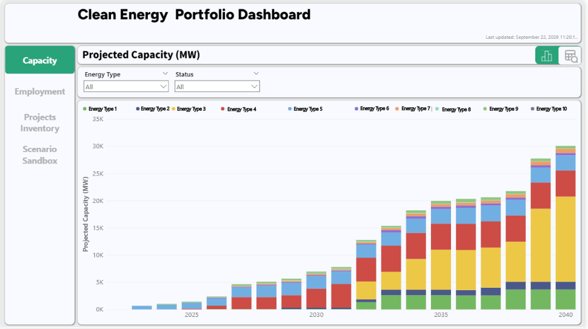
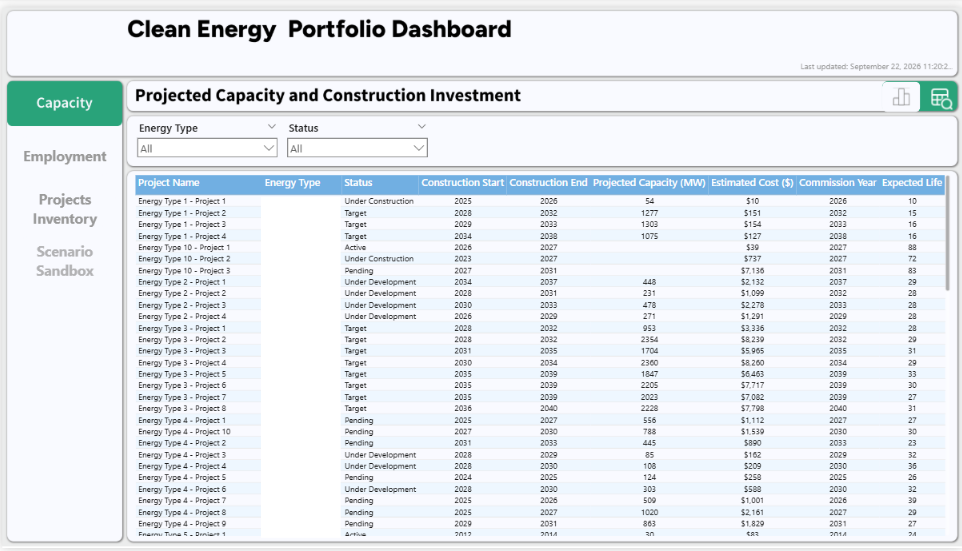
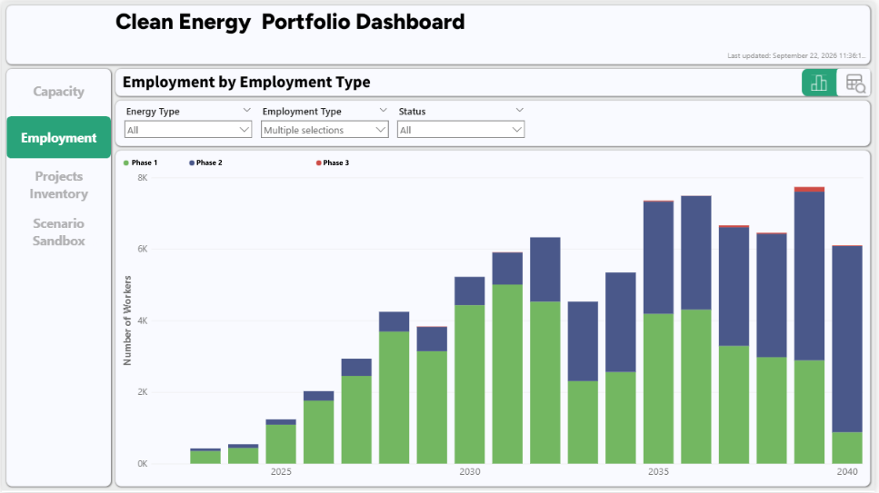
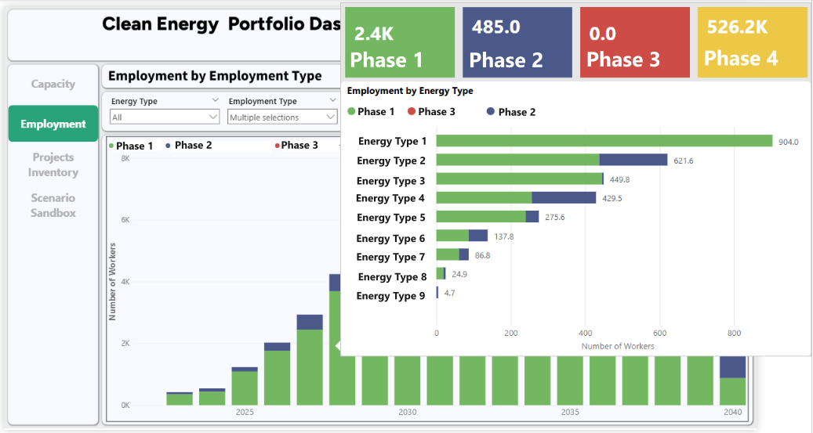
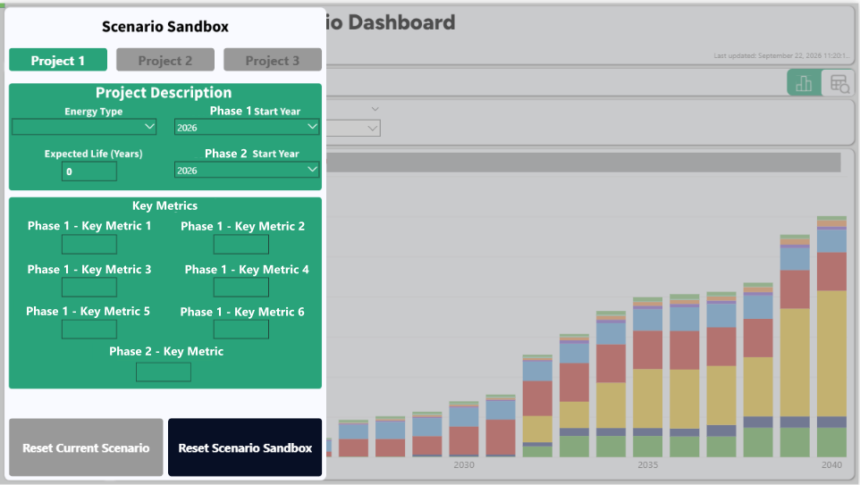

## Project Overview

**Project type:** Client-facing workforce analytics and decision-support tool

**My role:** Dashboard development, data transformation, analytical implementation, scenario modelling, user experience, and documentation

**Technologies:** Power BI, Power Query, DAX, Excel, Power Apps

**Development period:** Approximately three months

The Nova Scotia Clean Energy Workforce Dashboard was developed to support workforce planning associated with the province's transition toward clean energy.

The project required translating an existing workforce model into an accessible analytical tool that could help users examine projected employment demand across different energy technologies, development phases, and occupational groups.

I was responsible for developing the Power BI dashboard, implementing its analytical functionality, and designing an interactive scenario-modelling interface.

The finished product combined workforce projections, occupational analysis, and user-defined development scenarios within a single decision-support environment.

## The Dashboard

```{=html}
<div id="dashboardCarousel"
     class="carousel slide dashboard-carousel"
     aria-label="Clean Energy Workforce Dashboard screenshots">

  <div class="carousel-inner">

    <!-- Screenshot 1: Capacity Chart -->

    <div class="carousel-item active">

      

      <p class="dashboard-slide-caption">
        1 / 5 — Capacity Analysis
      </p>

    </div>


    <!-- Screenshot 2: Capacity Table -->

    <div class="carousel-item">

      

      <p class="dashboard-slide-caption">
        2 / 5 — Capacity Data
      </p>

    </div>


    <!-- Screenshot 3: Employment Chart -->

    <div class="carousel-item">

      

      <p class="dashboard-slide-caption">
        3 / 5 — Employment Projections
      </p>

    </div>


    <!-- Screenshot 4: Employment Tooltip -->

    <div class="carousel-item">

      

      <p class="dashboard-slide-caption">
        4 / 5 — Detailed Employment Analysis
      </p>

    </div>


    <!-- Screenshot 5: Scenario Sandbox -->

    <div class="carousel-item">

      

      <p class="dashboard-slide-caption">
        5 / 5 — Scenario Modelling
      </p>

    </div>

  </div>


  <!-- Previous image -->

  <button
    class="carousel-control-prev"
    type="button"
    data-bs-target="#dashboardCarousel"
    data-bs-slide="prev"
    aria-label="Previous screenshot">

    <span
      class="carousel-control-prev-icon"
      aria-hidden="true">
    </span>

  </button>


  <!-- Next image -->

  <button
    class="carousel-control-next"
    type="button"
    data-bs-target="#dashboardCarousel"
    data-bs-slide="next"
    aria-label="Next screenshot">

    <span
      class="carousel-control-next-icon"
      aria-hidden="true">
    </span>

  </button>

</div>
```

The dashboard allows users to explore projected employment demand associated with clean-energy development in Nova Scotia.

Users can examine employment projections across energy technologies, development phases, and occupational groups, with interactive controls for selecting the information most relevant to their workforce-planning questions.

The interface brings together multiple analytical perspectives without requiring users to navigate the underlying workforce model directly.

## My Contributions

I was responsible for developing the dashboard as an analytical product, including the following components.

**Data transformation and analytical modeling**

Translated an existing Excel-based workforce model into a Power BI data model, using Power Query and DAX to prepare project data, implement employment calculations, and support analysis across multiple dimensions.

**Dashboard development and user experience**

Designed and developed the interactive reporting interface, including employment visualizations, filtering, navigation, and occupational breakdowns.

**Scenario-modeling functionality**

Developed functionality allowing users to configure hypothetical clean-energy development scenarios and examine their implications for projected employment demand.

**Project data management**

Integrated Power Apps functionality to support the management of project records within the broader dashboard environment.

**Documentation and delivery**

Produced a comprehensive user guide and incorporated multiple rounds of client feedback to support the delivery and ongoing use of the finished product.

The broader project's workforce-modeling methodology and underlying assumptions were developed collaboratively. My primary responsibilities centred on implementing the analytical model within Power BI and developing the interactive product.

## How It Works

The dashboard combines three principal components:

1.  **Project inventory:** Information about clean-energy projects, including their technologies, development schedules, capacity, and investment assumptions.

2.  **Workforce model:** Employment assumptions and occupational distributions used to estimate workforce demand associated with the underlying projects.

3.  **Scenario modelling:** User-defined development assumptions that allow users to examine potential changes in projected employment demand.

These components feed into the dashboard's employment calculations and interactive visualizations.

```{mermaid}
flowchart TD
    A["Clean-energy project inventory"] --> D["Employment calculations"]
    B["Workforce assumptions and occupational mappings"] --> D
    C["User-defined development scenarios"] --> D

    D --> E["Employment projections"]
    E --> F["Analysis by year, technology and development phase"]
    E --> G["Occupational demand analysis"]
```

*Conceptual overview of the dashboard's analytical functionality. The diagram is simplified and does not represent the complete Power BI data model.*

## Scenario Modelling

A central feature of the dashboard is its ability to examine hypothetical clean-energy development scenarios.

Users can configure up to three scenarios by specifying project characteristics and development assumptions.

These inputs are incorporated into the dashboard's employment calculations, allowing users to examine how additional or alternative development activity would affect projected workforce demand.

Scenario results can be explored through the same employment and occupational analysis interfaces used for the underlying project inventory.

This functionality extends the dashboard beyond static reporting by allowing users to examine the workforce implications of different development assumptions.

## Technical Approach

The dashboard required translating an existing workforce model into an interactive Power BI environment while maintaining consistent calculations across multiple analytical dimensions.

Three aspects of the implementation were particularly important.

### 1. Employment calculations

Developed DAX measures to calculate employment demand across different energy technologies and project development phases.

The measures incorporate the relevant workforce assumptions while supporting filtering and aggregation across the dashboard's analytical dimensions.

### 2. Occupational analysis

Implemented occupational distributions that allow projected employment demand to be examined at different levels of occupational detail.

This provides users with both an overall view of workforce requirements and more detailed information about the types of workers associated with projected development activity.

### 3. Integration of scenario results

Developed scenario calculations that incorporate user-defined development assumptions into the dashboard's employment analysis.

The resulting employment estimates can be examined alongside the underlying project inventory, allowing users to compare baseline and hypothetical workforce demand within a consistent analytical framework.

## Delivery and Outcomes

The dashboard was developed over approximately three months, with responsibility for its technical implementation, interface development, testing, and iterative refinement.

Following multiple rounds of client feedback, the finished product was delivered with a comprehensive user guide covering its functionality and use.

The client provided positive feedback on the completed dashboard, and the project subsequently entered an ongoing maintenance arrangement.

The finished product provides a consolidated environment for examining projected clean-energy workforce demand and exploring how alternative development scenarios could affect future occupational requirements.

## [← Back to Projects](../projects.qmd)