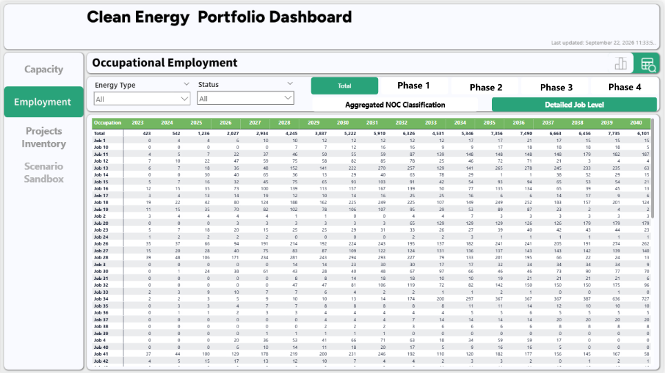

## Project Overview

**Project type:** Client-facing workforce analytics and decision-support tool.

**My role:** Dashboard development, data transformation, analytical implementation, scenario modelling, user experience, and documentation.

**Technologies:** Power BI, Power Query, DAX, Excel, Power Apps

**Development period:** Approximately three months for initial product.

The Clean Energy Labour Forcasting Dashboard was developed to support the labour force planning efforts of a provincial government as it made substantial, long-term investments in renewable and carbon neutral electricity generation, and related infrastructure.

The project required translating an existing, manually maintained labour force model into an automated data pipeline and interactive analytical tool that made the underlying data and insights more accessible to non-technical stakeholders. End users could examine projected capacity and employment demand across 10 energy types, 3 development phases, and 2 occupational groupings. It also allowed users to introduce new projects and modify existing ones through an in-application "writeback" function developed using Power Apps, and develop custom scenarios via a pop out "Scenario Sandbox" tool.

I was responsible for developing the Power BI dashboard. This included the back end data preparation and processing pipeline, relationships, and validation, and the front end graphical design, analytical functionality, interactive elements, and scenario modelling interface.

The finished product combined workforce projections, occupational analysis, and user-defined development scenarios within a single decision-support environment.

## The Dashboard

```{=html}
<div id="dashboardCarousel"
     class="carousel slide dashboard-carousel"
     aria-label="Clean Energy Workforce Dashboard screenshots">

  <div class="carousel-inner">

    <!-- Screenshot 1: Capacity Chart -->

    <div class="carousel-item active">

      

      <p class="dashboard-slide-caption">
        1 / 6 — Capacity Analysis
      </p>

    </div>


    <!-- Screenshot 2: Capacity Table -->

    <div class="carousel-item">

      

      <p class="dashboard-slide-caption">
        2 / 6 — Capacity Data
      </p>

    </div>


    <!-- Screenshot 3: Employment Chart -->

    <div class="carousel-item">

      

      <p class="dashboard-slide-caption">
        3 / 6 — Employment Projections
      </p>

    </div>


    <!-- Screenshot 4: Employment Tooltip -->

    <div class="carousel-item">

      

      <p class="dashboard-slide-caption">
        4 / 6 — Detailed Employment Analysis
      </p>

    </div>


    <!-- Screenshot 5: Employment Table -->

    <div class="carousel-item">

      

      <p class="dashboard-slide-caption">
        5 / 6 — Employment Table
      </p>

    <!-- Screenshot 6: Scenario Sandbox -->

    </div>

        <div class="carousel-item">

      

      <p class="dashboard-slide-caption">
        6 / 6 — Scenario Modelling
      </p>

    </div>

  </div>


  <!-- Previous image -->

  <button
    class="carousel-control-prev"
    type="button"
    data-bs-target="#dashboardCarousel"
    data-bs-slide="prev"
    aria-label="Previous screenshot">

    <span
      class="carousel-control-prev-icon"
      aria-hidden="true">
    </span>

  </button>


  <!-- Next image -->

  <button
    class="carousel-control-next"
    type="button"
    data-bs-target="#dashboardCarousel"
    data-bs-slide="next"
    aria-label="Next screenshot">

    <span
      class="carousel-control-next-icon"
      aria-hidden="true">
    </span>

  </button>

</div>
```

The dashboard allows users to explore projected generation capacity and employment demand associated with clean-energy development.

Users can examine employment projections across energy technologies, development phases, and occupational groups, with interactive controls for selecting the information most relevant to their workforce-planning questions.

The interface brings together multiple analytical perspectives without requiring users to navigate the underlying workforce model directly.

## My Contributions

I was responsible for developing the dashboard as an analytical product, including the following components:

**Data transformation and analytical modelling**

Translated an existing Excel-based workforce model into a Power BI data model, using Power Query and DAX to prepare project data, implement employment calculations, and support analysis across multiple dimensions.

**Dashboard development and user experience**

Designed and implemented passive UI elements, including the layout and overall visual design.

Designed and developed the interactive reporting interface, including employment visualizations, filtering, navigation, and capacity and occupational breakdowns.

**Scenario-modelling functionality**

Developed functionality allowing users to configure hypothetical clean-energy development scenarios and examine their implications for projected capacity and employment demand.

**Project data management**

Integrated Power Apps functionality to support the management of project records within the dashboard environment.

**Documentation and delivery**

Produced a comprehensive user guide and incorporated multiple rounds of client feedback to support the delivery and ongoing use of the finished product.

The broader project's workforce-modelling methodology and underlying assumptions were developed collaboratively. My primary responsibilities centred on implementing the analytical model within Power BI and developing the interactive product.

## How It Works

The dashboard combines three principal components:

1.  **Project inventory:** Information about clean-energy projects, including their technologies, development schedules, capacity, and development assumptions.

2.  **Workforce model:** Employment assumptions and occupational distributions used to estimate workforce demand associated with the underlying projects.

3.  **Scenario modelling:** User-defined development assumptions that allow users to examine potential changes in projected employment demand.

These components feed into the dashboard's employment calculations and interactive visualizations.

## Scenario Modelling

A central feature of the dashboard is the Scenario Sandbox, which allows users to configure up to three hypothetical clean-energy development scenarios by specifying project characteristics and development assumptions.

These inputs are incorporated into the dashboard's employment calculations, allowing users to examine how additional or alternative development activity would affect projected workforce demand.

Scenario results can be explored through the same employment and occupational analysis interfaces used for the underlying project inventory.

This functionality extends the dashboard beyond static reporting by allowing users to examine the workforce implications of different development assumptions.

## Technical Approach


The dashboard required translating an existing workforce model into an interactive Power BI environment while maintaining consistent calculations across multiple analytical dimensions.

Three aspects of the implementation were particularly important.

### 1. Employment calculations

Developed DAX measures to calculate employment demand across different energy technologies and project development phases.

The measures incorporate the relevant workforce assumptions while supporting filtering and aggregation across the dashboard's analytical dimensions.

### 2. Occupational analysis

Implemented occupational distributions that allow projected employment demand to be examined at different levels of occupational detail.

This provides users with both an overall view of workforce requirements and more detailed information about the types of workers associated with projected development activity.

### 3. Integration of scenario results

Developed scenario calculations that incorporate user-defined development assumptions into the dashboard's employment analysis.

The resulting employment estimates can be examined alongside the underlying project inventory, allowing users to compare baseline and hypothetical workforce demand within a consistent analytical framework.

## Delivery and Outcomes

The dashboard was developed over approximately three months, during which I was given sole responsibility for its technical implementation, interface development, testing, and iterative refinement.

Following multiple rounds of client feedback, the finished product was delivered with a comprehensive user guide covering its functionality and use.

Client reception of the completed dashboard was very positive, and the project subsequently entered an ongoing maintenance arrangement.

The finished product provides a consolidated environment for examining projected clean-energy capacity and workforce demand and enables the exploration of alternative development scenarios and how they could affect future occupational requirements.

## [← Back to Analytics Projects](../analytics_projects.qmd)