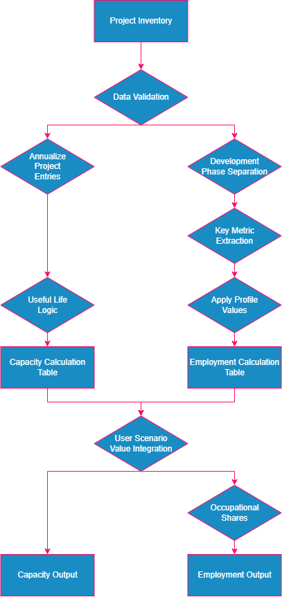
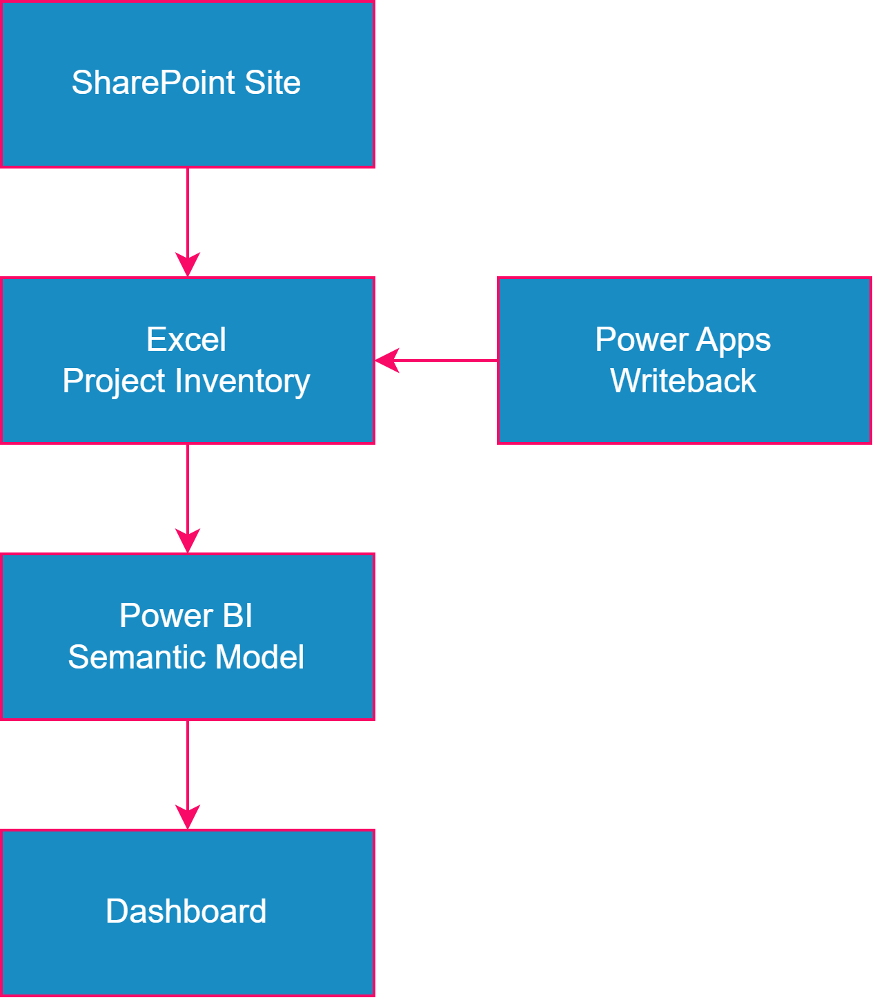

## Project Overview

**Project type:** Client-facing workforce analytics and decision-support tool

**My role:** Dashboard development, data transformation, analytical implementation, scenario modelling, user experience, and documentation

**Technologies:** Power BI, Power Query, DAX, Excel, Power Apps

**Development period:** Approximately three months for the initial product

::: {.callout-note}
**Portfolio note:** Screenshots on this page show a sanitized version of the dashboard. Identifying project information and proprietary calculation inputs have been altered or removed.
:::

The Clean Energy Labour Forecasting Dashboard was developed to support the labour force planning efforts of a provincial government as it made substantial, long-term investments in renewable and carbon-neutral electricity generation and related infrastructure.

The project required translating an existing, manually maintained labour force model into an automated data pipeline and interactive analytical tool that made the underlying data and insights more accessible to non-technical stakeholders.

End users could examine projected capacity and employment demand across 10 energy types, 3 development phases, 2 occupational groupings, and a 15-year forecasting period. The dashboard also allowed authorized users to introduce new projects and modify existing ones through an in-application writeback function developed using Power Apps, as well as develop custom scenarios through a separate Scenario Sandbox.

I was responsible for developing the Power BI dashboard. This included the back-end data preparation and processing pipeline, relationships, validation, front-end graphical design, analytical functionality, interactive elements, and scenario-modelling interface.

The finished product combined capacity forecasting, workforce projections, occupational analysis, project management, and user-defined development scenarios within a single decision-support environment.


## My Contributions

I was responsible for developing the dashboard as an analytical product, including the following components.

### Data Transformation and Analytical Modelling

Translated an existing Excel-based workforce model into a Power BI data model, using Power Query and DAX to prepare project data, implement employment calculations, and support analysis across multiple dimensions.

### Dashboard Development and User Experience

Designed the overall visual layout and passive user-interface elements.

Designed and developed the interactive reporting interface, including capacity and employment visualizations, filtering, navigation, occupational breakdowns, contextual tooltips, and alternative chart and table views.

### Scenario-Modelling Functionality

Developed functionality allowing users to configure hypothetical clean-energy development scenarios and examine their implications for projected capacity and employment demand.

### Project Data Management

Integrated Power Apps functionality to support the management of project records directly within the dashboard environment.

### Documentation and Delivery

Produced a comprehensive user guide and incorporated multiple rounds of client feedback to support the delivery and ongoing use of the finished product.

The broader project's workforce-modelling methodology and underlying assumptions were developed collaboratively. My primary responsibilities centred on implementing the analytical model within Power BI and developing the interactive product.


## Product Walkthrough

The dashboard allows users to explore the implications of clean-energy development across two primary analytical dimensions: projected energy generation capacity and projected employment.

Users can examine these dimensions across 10 energy types, 3 development phases, 2 occupational profiles, and 15 years. The dashboard also allows users to configure hypothetical development scenarios and examine their implications for projected capacity and employment demand.

Finally, an embedded Power Apps interface allows authorized users to add new projects and modify existing ones without leaving the Power BI environment.


::: {.walkthrough-section}

::: {.walkthrough-media}

```{=html}
<div id="capacityCarousel"
     class="carousel slide section-carousel"
     aria-label="Capacity dashboard views">

  <div class="carousel-inner">

    <div class="carousel-item active">

      

      <p class="dashboard-slide-caption">
        Capacity chart
      </p>

    </div>


    <div class="carousel-item">

      

      <p class="dashboard-slide-caption">
        Capacity table
      </p>

    </div>

  </div>


  <button
    class="carousel-control-prev"
    type="button"
    data-bs-target="#capacityCarousel"
    data-bs-slide="prev"
    aria-label="Previous capacity view">

    <span
      class="carousel-control-prev-icon"
      aria-hidden="true">
    </span>

    <span class="visually-hidden">
      Previous
    </span>

  </button>


  <button
    class="carousel-control-next"
    type="button"
    data-bs-target="#capacityCarousel"
    data-bs-slide="next"
    aria-label="Next capacity view">

    <span
      class="carousel-control-next-icon"
      aria-hidden="true">
    </span>

    <span class="visually-hidden">
      Next
    </span>

  </button>

</div>
```

:::


::: {.walkthrough-copy}

### Capacity

The Capacity view provides an overview of anticipated clean-energy development over time, taking into account the gradual deployment of projects, their expected useful lives, and their cumulative contributions to overall generation capacity.

Users can examine expected capacity by technology, project status, and year, allowing them to understand both the scale and timing of the project pipeline.

Users can also move between chart and table views. This interface is designed to support both a high-level, aggregated view of expected development and a more granular examination of individual technologies, project statuses, and time periods.

:::

:::


::: {.walkthrough-section}

::: {.walkthrough-media}

```{=html}
<div id="employmentCarousel"
     class="carousel slide section-carousel"
     aria-label="Employment dashboard views">

  <div class="carousel-inner">

    <div class="carousel-item active">

      

      <p class="dashboard-slide-caption">
        Employment chart
      </p>

    </div>


    <div class="carousel-item">

      

      <p class="dashboard-slide-caption">
        Detailed employment tooltip
      </p>

    </div>


    <div class="carousel-item">

      

      <p class="dashboard-slide-caption">
        Employment table
      </p>

    </div>

  </div>


  <button
    class="carousel-control-prev"
    type="button"
    data-bs-target="#employmentCarousel"
    data-bs-slide="prev"
    aria-label="Previous employment view">

    <span
      class="carousel-control-prev-icon"
      aria-hidden="true">
    </span>

    <span class="visually-hidden">
      Previous
    </span>

  </button>


  <button
    class="carousel-control-next"
    type="button"
    data-bs-target="#employmentCarousel"
    data-bs-slide="next"
    aria-label="Next employment view">

    <span
      class="carousel-control-next-icon"
      aria-hidden="true">
    </span>

    <span class="visually-hidden">
      Next
    </span>

  </button>

</div>
```

:::


::: {.walkthrough-copy}

### Employment

The Employment view provides an overview of projected workforce demand associated with the development of clean-energy projects.

Projections are based on predefined key metrics associated with each energy type. A more detailed description of the calculation methodology is provided in the Technical Architecture section below.

As with the Capacity view, users can examine projected employment demand across multiple dimensions, including energy type, development phase, project status, and point in time.

The Employment view also includes contextual tooltips that provide additional information for each year on a per-technology and per-development-phase basis.

Users can move between chart and table views. In the Employment table, projected workforce demand can be examined using two occupational groupings.

The first, **Aggregated NOC Classification**, groups occupations according to their National Occupational Classification (NOC) code.

The second, **Detailed Job Level**, breaks employment demand down by job title. Job titles were sourced from interviews with major clean-energy project developers and mapped onto the NOC classification system to provide a consistent analytical framework.

The Detailed Job Level view trades some of the consistency of the NOC classification system for greater occupational specificity, as several job titles can fall within the same broader NOC classification.

:::

:::


::: {.walkthrough-section}

::: {.walkthrough-media}

.png)

:::


::: {.walkthrough-copy}

### Scenario Sandbox

The Scenario Sandbox is a secondary interface that allows users to configure hypothetical clean-energy development scenarios and examine their implications for projected capacity and employment demand.

Users can specify project characteristics and development assumptions for up to three hypothetical scenarios. These assumptions are incorporated into the dashboard's capacity and employment calculations.

The Scenario Sandbox was designed to address two specific problems.

First, the dashboard's underlying project inventory may contain sensitive information that should not be shared with all users. Without a separate scenario tool, users with restricted access could be unable to examine the implications of additional or alternative development activity without working through an intermediary with full access.

This creates potential bottlenecks in the decision-making process and can reduce the overall utility of the dashboard. It can also create incentives for poor security practices, such as providing broader access to sensitive information simply to facilitate scenario analysis.

Second, using the underlying Project Inventory itself to explore hypothetical development would create practical version-management problems. Testing scenarios in this way would require frequent modifications and refreshes, potentially creating version conflicts and ambiguity around which project inventory represented the authoritative baseline.

The Scenario Sandbox addresses these concerns by allowing users to configure hypothetical scenarios independently of the underlying Project Inventory, with results updating immediately within the user-facing environment.

:::

:::


::: {.walkthrough-section}

::: {.walkthrough-media}


:::


::: {.walkthrough-copy}

### Project Inventory and Writeback

The Project Inventory page gives authorized users a complete view of the underlying project inventory that informs the dashboard's projections.

The page also incorporates an embedded Power Apps writeback interface that allows authorized users to add, edit, and delete projects without leaving the Power BI environment.

This provides a more accessible way of maintaining the project dataset while preserving the underlying SharePoint-hosted Excel workbook as the source of truth.

Changes made through the Power Apps interface are reflected in the Project Inventory and incorporated into the dashboard's calculations when the semantic model is refreshed.

:::

:::


## Technical Architecture

The dashboard converts validated project-level data into two parallel analytical streams: Capacity and Employment.

Each stream applies its own calculation methodology, while hypothetical Scenario Sandbox inputs are incorporated into the relevant calculation path before final aggregation.


::: {.technical-flow}

::: {.technical-diagram}

{.technical-diagram-image}

:::


::: {.technical-notes}


::: {.technical-note}

### 1. Data Ingestion & Validation

The calculation process begins by ingesting the Project Inventory as a staging query.

An initial data-integrity check determines whether each project contains sufficient information to be included in the dashboard's calculations.

Validated project information is then transformed into separate tables supporting the Capacity and Employment calculation streams.

:::


::: {.technical-note}

### 2. Parallel Calculation Tracks

**Capacity**

Capacity calculations generate annual entries for each project beginning when generation is expected to commence and continuing throughout its assigned useful life.

This allows projected generation capacity to accumulate over time while remaining filterable by energy technology and project status.

**Employment**

Employment calculations are performed separately for each development phase.

Energy-specific key metrics are combined with profile values and estimated occupational employment shares to generate initial Job Level employment estimates.

These estimates are subsequently aggregated using National Occupational Classification groupings.

:::


::: {.technical-note}

### 3. Scenario Integration

Scenario Sandbox inputs enter the relevant calculation stream before final aggregation.

For Capacity, hypothetical generation capacity is distributed across the specified useful life of the scenario project.

For Employment, the relevant energy-type key metric is incorporated before occupational employment calculations are performed.

This allows hypothetical projects to pass through the same analytical framework as projects contained in the underlying inventory.

:::


::: {.technical-note}

### 4. Analytical Outputs

Following aggregation, the resulting Capacity and Employment values feed the dashboard's user-facing analytical views.

Users can then examine projected development and workforce demand across dimensions such as year, energy technology, project status, development phase, and occupational grouping.

:::


:::

:::

::: {.walkthrough-section}

::: {.walkthrough-media}



:::


::: {.walkthrough-copy}

### Backend & Writeback Architecture

The dashboard operates on an unconventional backend design shaped by the client's technical and accessibility requirements.

Rather than relying on a conventional SQL database, the dashboard uses a series of Excel workbooks stored within a SharePoint environment.

Four of the five workbooks contain research inputs that are effectively static. The Project Inventory remains directly editable and acts as the source of truth for project-level information.

Authorized users can modify the Project Inventory either through the underlying SharePoint-hosted Excel workbook or through an embedded Power Apps interface within Power BI.

The Power Apps interface allows users to add, edit, and delete projects without leaving the dashboard environment.

When the semantic model is refreshed, the updated Project Inventory is read from SharePoint and incorporated into the dashboard's calculations.

:::

:::

## Delivery and Outcomes

The dashboard was developed over approximately three months, during which I was given sole responsibility for its technical implementation, interface development, testing, and iterative refinement.

Following multiple rounds of client feedback, the finished product was delivered with a comprehensive user guide covering its functionality and use.

Client reception of the completed dashboard was very positive, and the project subsequently entered an ongoing maintenance arrangement.

The finished product provides a consolidated environment for examining projected clean-energy capacity and workforce demand and enables the exploration of alternative development scenarios and how they could affect future occupational requirements.


[← Back to Analytics Projects](../analytics_projects.qmd)